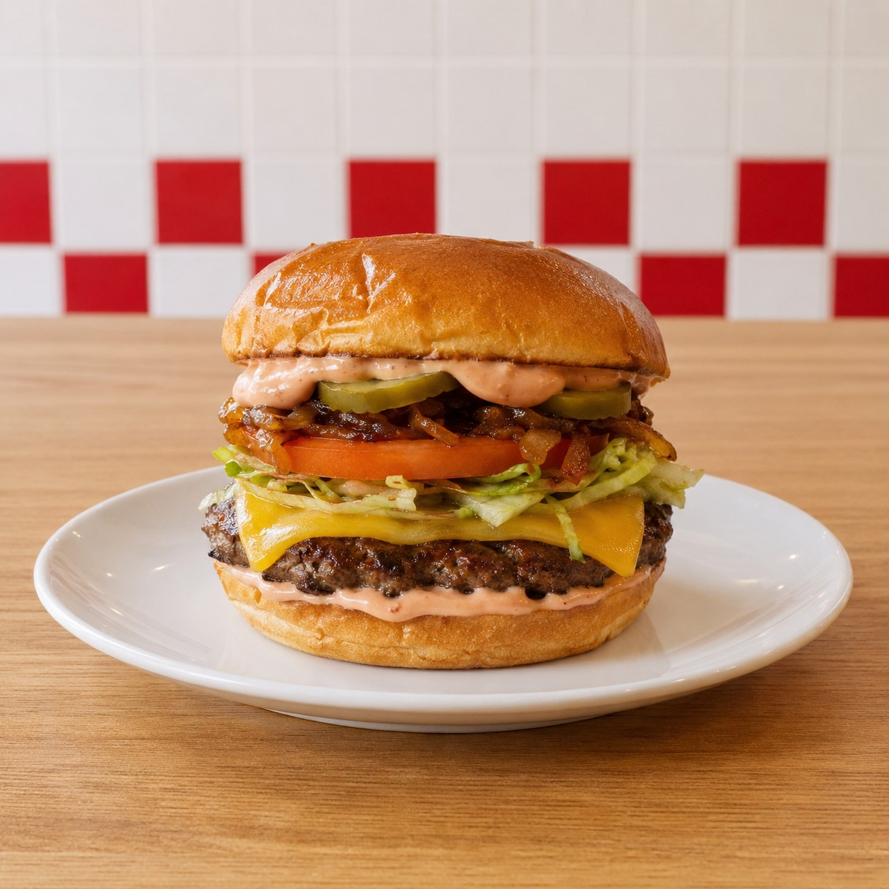

# 4½ Guys — Pop-Up Site

A one-page promotional website for **4½ Guys**, a 2-day pop-up burger business running **May 12–13 (blocks 2–4)** in the CBSS courtyard (Entrepreneurship 12, Charles Best Secondary).

Built with plain HTML, CSS, and a tiny bit of JavaScript — no frameworks, no build step.

---

## File overview

```
/
├── index.html          Main page
├── styles.css          All styling (design tokens at the top)
├── script.js           Sticky-header state + fade-in-on-scroll
├── README.md           You're reading it
├── /favicon
│   └── favicon.svg     Browser tab icon
└── /images
    └── README.txt      List of image filenames + dimensions to drop in
```

---

## Deploy to Vercel (the easy way)

You don't need to install anything. The whole flow is:

### 1. Put the project on GitHub

Open a terminal **inside this folder** and run:

```bash
git init
git add .
git commit -m "Initial 4½ Guys site"
git branch -M main
```

Then on github.com, create a new repository (e.g. `4-and-a-half-guys`). **Don't** add a README, .gitignore, or license — keep it empty. Copy the URL GitHub gives you, then:

```bash
git remote add origin https://github.com/<your-username>/4-and-a-half-guys.git
git push -u origin main
```

### 2. Deploy with Vercel

1. Go to [vercel.com](https://vercel.com) and sign in with your GitHub account.
2. Click **"Add New… → Project"**.
3. Pick the repo you just pushed.
4. Leave every setting on its default — Vercel auto-detects static HTML.
5. Click **Deploy**.

That's it. About 30 seconds later you'll have a live URL like `https://4-and-a-half-guys.vercel.app`. Every time you `git push`, Vercel redeploys automatically.

---

## Swap in real images

Photo placeholders are red `<div>`s with the item name. To replace them with real photos:

1. Drop your JPGs into `/images` using these filenames:

   | File | Recommended size | Where it shows |
   |---|---|---|
   | `logo-full.jpg` | 800 × 800 px | Hero (homepage center) |
   | `logo-small.jpg` | 200 × 200 px | Header + footer |
   | `burger-4-5-pounder.jpg` | 1200 × 900 px (4:3) | Menu card |
   | `burger-half-pounder.jpg` | 1200 × 900 px (4:3) | Menu card |
   | `fries.jpg` | 1200 × 900 px (4:3) | Menu card |
   | `combo.jpg` | 1200 × 900 px (4:3) | Menu card |

2. Open `index.html` and find each `<!-- TODO: replace with real image at images/... -->` comment. Replace the `<div class="logo-placeholder">…</div>` (or `<div class="menu-card__image">…</div>`) **right below it** with an `` tag:

   ```html
   
   ```

   The card layout will keep working — the new image inherits the same box.

3. Save, commit, push:
   ```bash
   git add .
   git commit -m "Add real menu photos"
   git push
   ```
   Vercel auto-deploys.

---

## Edit menu items or prices

Open `index.html` and search for `<!-- ===== BURGERS =====` (or `FRIES`, `COMBO DEALS`, `DRINKS`). Each item is a `<article class="menu-card">` block — you'll see the name, description, and price in plain text. Change them, save, push.

If you add a brand-new item, copy an existing `<article>` block and paste it in the same category's `<div class="menu-grid">`.

---

## Edit colors, fonts, or spacing

All design tokens live at the top of `styles.css` under `:root`:

```css
--color-red:   #D62828;   /* main brand red */
--color-cream: #FAF7F2;   /* page background */
--font-display: "Anton";  /* big headlines */
--font-body:    "Inter";  /* body text */
```

Change a value there and it updates everywhere.

---

## Local preview

Just double-click `index.html`. It opens in your browser and works offline (except for the Google Fonts).

To test how it looks on a phone, open browser dev tools (F12) and toggle the device toolbar — set it to 375px wide.

---

## Notes

- Total page weight is ~30KB without photos. Keep each photo under ~200KB and the whole page stays fast.
- The favicon is an SVG (`favicon/favicon.svg`). Every modern browser supports it.
- No `package.json`, no `node_modules`, no build step — Vercel just serves the files as-is.
